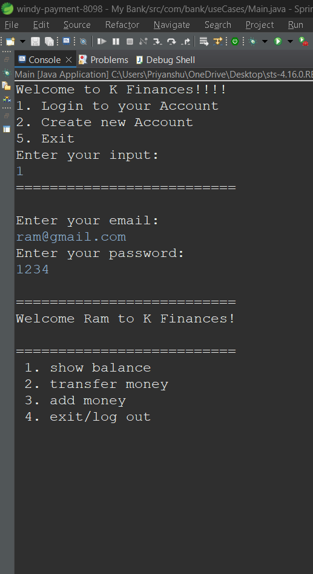
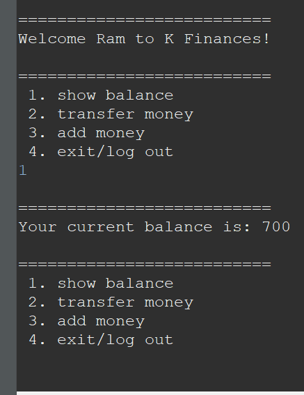
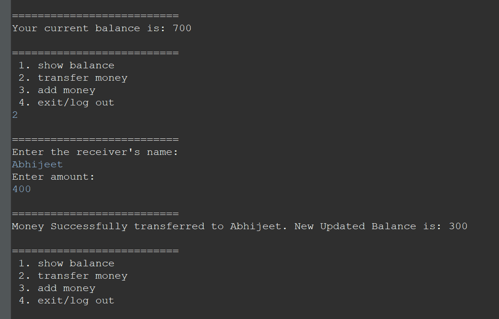
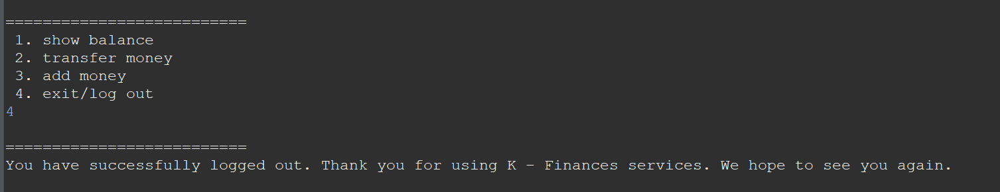

# Mini Banking Application

Hello Fellas,

This is a mini banking application that I created using JAVA and MySQL. It is a console based application. This mini application lets a old user log in and a new user sign up. After that the user can check their balance, transfer money to another person, and add money to their account.

There are a lot of different kind of banking traqnsaction which involve several parties like merchant, receiver, bank, etc. so to handle all thos transaction in JAVA, there is a JDBC(JAVA Database Connectivity) which provides us an API to connect, execute, fetch data from any databases. It provides a language JAVA database connectivity standards.  
Tranactions in JDBC  provides us a feature that considers a complete SQL statements as one unit, then executes once, and if any statement fails, the entire ttransactions fails.

In this mini application, to handle a transaction we are using JDBC transaction consistent. This Application provides a Menu-Driven Console Interface to a User Using that User can perform functions like create Account, Login, Veiw Balance, and Transfer Money to the other customer.

# Software Prerequisite:

<b>JAVA</b>: We'll be using JAVA to write all the necessary codes to perform all above mentioned functioned and detail.

<b>MySQL</b>: We'll be creating a database in MySQL only and in that db we'll have our tables like customer in which the details of the customers will be stored, to be used later on as the customer will perform the necessary actions in their account.

<b>STS</b>: We will be using STS to run our code, test it and debugging it whether it is working properly or not. All the necessary errors and exception handling and debugging required will be done in STS only.

Here are the images of the end product of how it will look and show outputs: 

 

 

 

 
